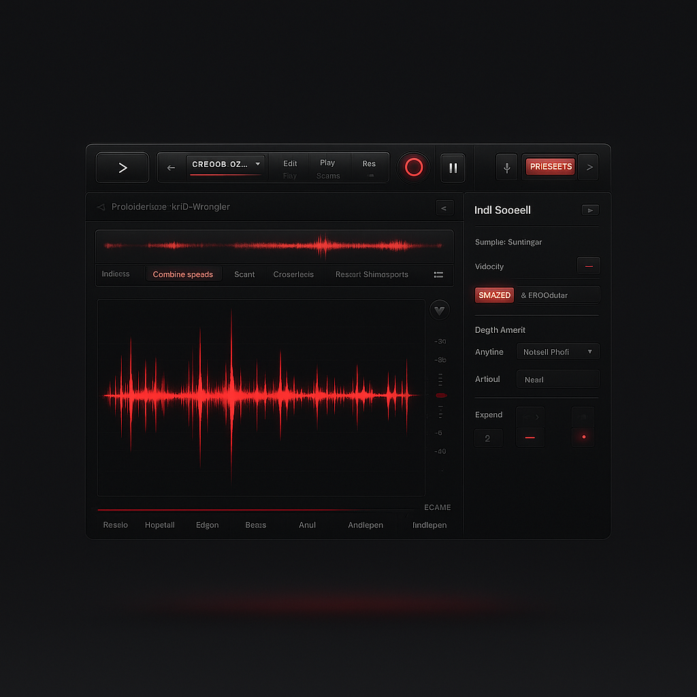

**AI-powered sample management for FL Studio**  
Scan → Analyze → Tag → Export. Stay in your flow.  

---

## 🎨 UI Mockup



---

## 🚀 Features (MVP)

- **Scan**: build a database from your sample library  
- **Analyze**: extract audio features (BPM, key, loudness, brightness, MFCCs, chroma …)  
- **Autotype**: automatic categorization (Kick, Snare, Pad, Drone, Impact …)  
- **Export**: write smart tags into the **FL Studio Browser**  

---

## 🛠️ Setup

```bash
# Create virtual environment
python -m venv .venv

# Activate (Windows)
. .venv\Scripts\activate
# Activate (macOS/Linux)
# source .venv/bin/activate

pip install -r requirements.txt
```

---

## 🏃 Quickstart

```bash
# Initialize DB
python -m src.cli init

# Scan sample folder (default in config.py)
python -m src.cli scan

# Analyze audio features
python -m src.cli analyze

# Autotype samples (rules only)
python -m src.cli autotype --no-knn

# Export tags to FL Studio
python -m src.cli export_fl "C:\Users\DEINNAME\Documents\Image-Line"   # Windows
python -m src.cli export_fl "~/Documents/Image-Line"               # macOS/Linux
```

---

## ⚙️ Configuration

### Profile-based Config

Sample Brain uses YAML configuration profiles. See `config/profiles.example.yaml` for the full reference.

For your local machine, copy the example and replace the placeholders:

```bash
cp config/profiles.example.yaml config/profiles.local.yaml
```

`config/profiles.local.yaml` is gitignored — no local paths are ever committed.

### CLI Overrides

| Flag | Scope | Example |
|------|-------|---------|
| `--profile <name>` | All commands | `--profile minimal-demo embed --limit 1` |
| `--config <path>` | All commands | `--config config/profiles.example.yaml embed --limit 1` |
| `embed --backend <name>` | Embed only | `embed --backend clap --limit 1` |

### Environment Variables

| Variable | Overrides |
|----------|-----------|
| `SAMPLE_BRAIN_PROFILE` | Active profile name |
| `SAMPLE_BRAIN_EMBEDDING_BACKEND` | Embedding backend |
| `SAMPLE_BRAIN_LIBRARY_ROOTS` | Library root paths |
| `SAMPLE_BRAIN_FL_USER_DATA` | FL Studio user data path |
| `SAMPLE_BRAIN_MODEL_CACHE_DIR` | Model cache directory |
| `SAMPLE_BRAIN_DB_PATH` | SQLite database path |
| `SAMPLE_BRAIN_MAX_TAGS` | Export max tags |

### Precedence

```
built-in default < example profile < local profile < environment variables < CLI flags
```

**Security:** Never commit real sample paths, DB files, reports, indexes, or model caches.
See [`docs/DATA_AND_ARTIFACT_POLICY.md`](./docs/DATA_AND_ARTIFACT_POLICY.md) for the full policy.

---

## 📚 Documentation

### Architecture & Requirements

- [Product Requirements](./docs/PRODUCT_REQUIREMENTS.md) — vision, audience, problem, MVP scope
- [System Requirements](./docs/SYSTEM_REQUIREMENTS.md) — functional and non-functional requirements, constraints
- [Target Architecture](./docs/TARGET_ARCHITECTURE.md) — current and target pipeline, component boundaries, data flow
- [Data and Artifact Policy](./docs/DATA_AND_ARTIFACT_POLICY.md) — what is committed vs untracked

### EPIC Specs

- [EPIC 1: Config and Profiles](./docs/EPIC_1_CONFIG_PROFILES.md) — configuration layers, profile design, env vars, migration plan
- [EPIC 2: Semantic Search Foundation](./docs/EPIC_2_SEMANTIC_SEARCH_SPEC.md) — embedding, indexing, search contracts and milestones
- [DAW Integration](./docs/DAW_INTEGRATION_SPEC.md) — FL Studio export, Ableton/Reaper research

### Project

- [Issue Backlog](./docs/ISSUE_BACKLOG.md) — planned work across all epics
- [Project Structure](./STRUCTURE.md)  
- [Docs folder](./docs/README.md) (setup, roadmap, details)

---

## ⚖️ License

MIT License – free to use, hack and share.  
Dependencies: see [THIRD_PARTY_LICENSES.md](./THIRD_PARTY_LICENSES.md).  

---

🎧 **Your sound. Your flow.**
