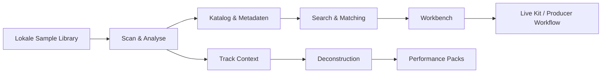
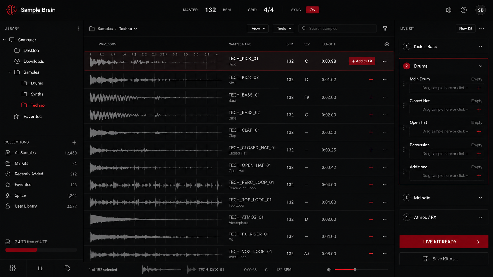
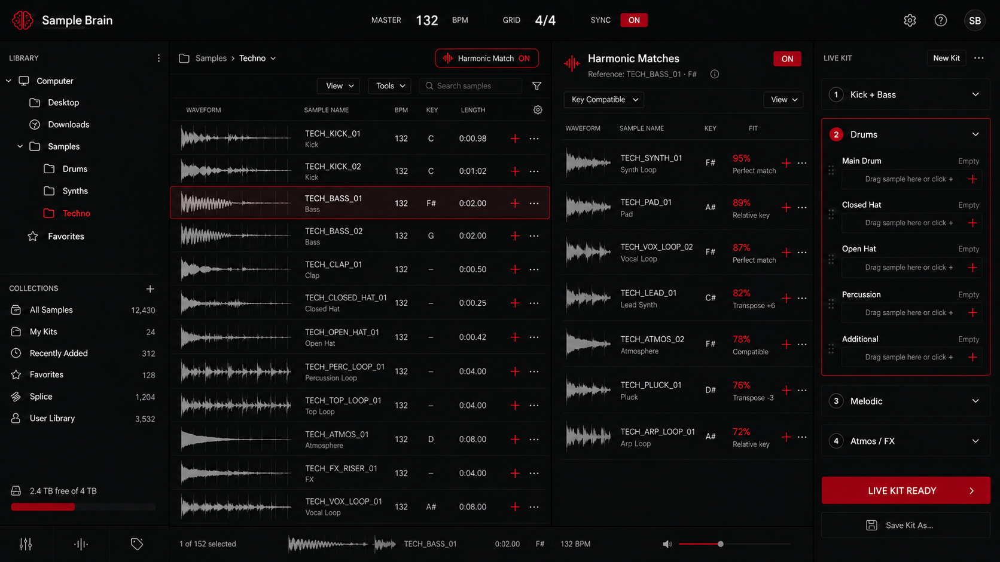

# Sample Brain

Sample Brain ist ein lokales Werkzeug für Sample-Analyse, musikalisches Matching, Track-Zerlegung und wiederverwendbare Performance Packs für Producing-Workflows.

---

## Portfolio-Überblick

**Sample Brain** löst ein Problem aus meiner eigenen Musikproduktion: Große lokale Sample-Libraries enthalten viel musikalisches Potenzial, aber Dateinamen und Ordnerstrukturen helfen nur begrenzt dabei, im richtigen Moment den passenden Sound zu finden.

Das Projekt übersetzt dieses Problem in ein **local-first Producing-System**: Samples werden lokal analysiert, katalogisiert, musikalisch verglichen und in einem Workbench-Workflow nutzbar gemacht. Private Audiodateien bleiben auf dem Rechner; die Kernfunktionen benötigen keine Cloud.

### Was heute tatsächlich funktioniert

Auf `main` sind unter anderem verfügbar:

- lokaler Sample-Katalog mit Audioanalyse und Metadaten,
- BPM-/Key-/Typ-basierte Matching-Logik,
- Track-Context-Analyse ohne Katalog-Mutation,
- NumPy-basierte Suche sowie optionale experimentelle CLAP-/sqlite-vec-Pfade,
- Track-Deconstruction und portable Performance Packs,
- lokaler Workbench mit Library, Preview, Matching und Live-Kit-Funktionen.

**Nicht als fertig dargestellt werden:** VST3, Realtime Fit & Transform und alle Funktionen, deren Evidence noch nicht für einen Produktionsclaim reicht. Die detaillierte Statusmatrix steht direkt im nächsten Abschnitt.

### Meine Rolle / AI-assisted Development Model

Meine Kernleistung in diesem Projekt liegt nicht darin, möglichst viel Python manuell zu schreiben. Ich entwickle Sample Brain **AI-native**:

- Problem- und Produktdefinition aus realem Producer-Workflow,
- Zerlegung in Features, Systemgrenzen und Acceptance Criteria,
- Architektur- und Schnittstellenentscheidungen,
- Orchestrierung spezialisierter Coding-/Review-Agenten,
- Review, Fehlersuche, Teststrategie und Evidence,
- iterative Entscheidung darüber, was shipped, experimentell oder noch nicht belastbar ist.

Ein erheblicher Teil der Implementierung entsteht AI-assisted. Dieses Repository soll deshalb **nicht** als Nachweis klassischer eigenständiger Python-Entwicklung gelesen werden, sondern als Nachweis für Product/System Thinking, Agenten-Orchestrierung, technische Spezifikation und Validation.

### Produktfluss


```mermaid
flowchart LR
    A[Lokale Sample Library] --> B[Scan & Analyse]
    B --> C[Katalog & Metadaten]
    C --> D[Search & Matching]
    D --> E[Workbench]
    E --> F[Live Kit / Producer Workflow]
    B --> G[Track Context]
    G --> H[Deconstruction]
    H --> I[Performance Packs]
```

### Visuelle Produkt-Richtung

Die folgenden Bilder sind **freigegebene UI-Mockups / Designziele**, keine als Live-Runtime ausgegebenen Screenshots:





Runtime-Screenshots werden nur aus einem verifizierten Build als Evidence erzeugt; der dafür vorhandene Visual-Acceptance-Pfad ist unter [WORKBENCH_VISUAL_ACCEPTANCE.md](docs/WORKBENCH_VISUAL_ACCEPTANCE.md) dokumentiert. So bleibt klar getrennt, was Designziel und was tatsächlich ausgeführter Produktzustand ist.

### Was dieses Projekt belegt

| Kompetenz | Konkrete Evidence im Projekt |
|---|---|
| **Product Thinking** | Zielgruppe, Problem Statement, MVP-/Target-Trennung und Product Principles |
| **System Thinking** | getrennte Pipeline-Schritte, klare Artefakte, Cache-/Pack-/Runtime-Verträge |
| **AI-/Agenten-Orchestrierung** | agent-shepherded Delivery mit spezialisierter Implementation, Review und Validation |
| **Requirements & Spezifikation** | Product-/System-Requirements, Acceptance Criteria und shipped-vs-target-Verträge |
| **Evaluation / QA** | Search-Evidence, Visual Acceptance, Regressionstests und explizite HOLD-/NO-CLAIM-Entscheidungen |
| **Creative Tech / Audio** | MIR-basierte Analyse, Matching, Producer-Workflow und eigene Musik-Domain |
| **Local-first / Privacy** | lokale Analyse, keine verpflichtende Cloud, keine privaten Samples im Repo |

### Drei Beispiele für bewusste Nicht-Claims

1. **CLAP Search:** auf synthetischen Fixtures gemessen, aber keine Produktionsreife auf echten Producer-Libraries behauptet.
2. **sqlite-vec:** Performance-Vorteile dokumentiert, Default-Wechsel aber wegen Qualitäts-/Gate-Abwägungen blockiert.
3. **Stem Separation:** technisch getestet, aber wegen ungeklärter Weight-Lizenz kein Produktions-Default.

Diese Entscheidungen sind Teil des Produkts: Sample Brain soll Unsicherheit sichtbar machen, statt Zielvision und belegte Realität zu vermischen.

### Technischer Reviewer – schneller Einstieg

```bash
python -m venv .venv
. .venv\Scripts\activate
pip install -r requirements.txt
pip install -e .
python -m src.cli --help
```

Für die Produktstory und Entscheidungen siehe [Case Study](docs/CASE_STUDY.md). Für den vollständigen Setup- und Feature-Quickstart siehe die technischen Abschnitte weiter unten.

---

## Was Sample Brain heute kann

| Bereich | Status | Was funktioniert |
|---------|--------|------------------|
| **Library / Sample-Katalog** | ✅ verfügbar | Ordner scannen (`scan`), Metadaten katalogisieren, BPM/Key/Loudness/Brightness/MFCC/Chroma analysieren (`analyze`), Root + Dur/Moll-Modus mit Evidenz (kein Erraten), Autotype/Klassifikation (`autotype`), FL Studio Export (`export_fl`). Originaldateien werden nie verändert. |
| **Track Context** | ✅ verfügbar | Einzelne WAV/FLAC ohne Katalog-Mutation analysieren (`context analyze`), Track Map v1 erzeugen (BPM, Key mit Root+Mode-Evidenz, Loudness, Brightness), portable Source Identity (Hash + Dateiname), Track Analysis Cache vermeidet wiederholte teure Analyse. |
| **Matching** | ✅ verfügbar | Katalogbasiertes Matching gegen Zielprofil (`match --target-bpm --target-key --desired-type`). BPM-Kompatibilität (linearer Decay + Half-/Double-Time mit 0.9 Penalty), Key-Kompatibilität (Root exakt + Mode exakt, wenn beide bekannt), Typ-Matching (exakt auf `pred_type`). Keine Camelot/Relative-Key/Circle-of-Fifths-Regeln. |
| **Search (Core)** | ✅ verfügbar | NumPy-Suche (Default), Metadaten-Filter (BPM-Range, Key, Type, Tags, Pred-Type), Hybrid-Reranking (BPM/Key-Gewichte). |
| **Search (CLAP, optional)** | 🧪 optional / experimentell | `laion/clap-htsat-unfused` (512-d), Text- und Audio-Embeddings, reproduzierbarer lokaler Tier-B Runtime-Pfad. Qualität auf synthetischen Fixtures gemessen: 6/6 Tier-B-Query-Klassen evaluiert (Text + Audio getrennt; finaler Run P@5 Text=0.185 / Audio=0.345, MRR@10 Text=0.420 / Audio=0.848, R@10 Audio=0.924). Audio auf diesen Fixtures deutlich stärker als Text. Weiterhin experimentell; keine Produktionsreife auf echten Producer-Libraries bewiesen. Kein CI-Model-Download. |
| **Search (sqlite-vec)** | 🧪 optional / experimentell | Opt-in via `--search-backend sqlite-vec` oder Profil. Nicht Default (Latency-Gates nicht alle PASS). Gate Evidence: `docs/benchmarks/SQLITE_VEC_GATE_EVIDENCE.md`. |
| **Track Deconstruction** | ✅ verfügbar | `deconstruct <track> --pack-root <dir>` analysiert Track, erzeugt Track Map, Arrangement (optional), Loop-/Section-Kandidaten, Bewertung, Rendering, Asset-Reanalyse. Schreibt `deconstruct_run.json` als Zwischen-Evidence. Resume/Cache-Reuse (pack-lokal, #262). Track Analysis Cache Integration (#237). |
| **Performance Packs** | ✅ verfügbar | Portable Pack-Struktur (`manifest.json`, `analysis/`, `loops/`, `sections/`, optional `stems/`). Pack-Import in Katalog (`pack-import`). Wiederaufnahme (pack-lokal #262) + wiederverwendbarer Track-Analyse-Cache (#237). |
| **Stem Separation** | 🧪 optional / experimentell | Technisch validiert: `htdemucs` & `htdemucs_ft` getestet (8/8 Runs), blinder Hörvergleich: `htdemucs` 4/4 bevorzugt, ~2× schneller. Aber: Weight-Lizenz **UNKNOWN/UNVERIFIED** für beide Modelle. Noch **kein** Produktions-Default, **nicht** im Standard-Deconstruction/Pack-Flow. Issues #247/#248/#249/#261 offen. |
| **Workbench** | ✅ verfügbar | Lokaler Tkinter-Workbench (`workbench`) für Playlist-Ansicht, Sample-Preview, Matching-Vorschläge und Harmonie-Finder (zweite Notebook-Seite: verwandte geladene Samples als Direkt/Verwandt/Transpose/Unsicher, siehe #213). Kein VST3-Produkt. |
| **VST3 / Realtime Transform** | 🚧 noch nicht fertig | Produktziel, aber nicht implementiert. |

---

## Was noch nicht fertig ist

- VST3 Plugin
- Realtime Fit & Transform Engine
- Finaler Stem-Default + Stem-Pack-Integration (#247, #249, #261)
- CLAP-Qualität auf echten Producer-Libraries ist noch nicht validiert; aktuelle Tier-B-Evidence (#216/#217 gemessen, #219 konsolidiert) ist synthetisch (6/6 Klassen, Text + Audio getrennt).
- Relative Key / Camelot / Circle-of-Fifths Kompatibilität im Matching
- Groove / Loop-Length Fit im Matching
- Producer Groups / Kick-Bass Rekonstruktion (#268)
- End-to-End-Privatpilot (#264)

---

## Aktuelle Arbeitsabläufe (Current Flows)

### Sample Library

```text
scan --root <SAMPLE_ROOT> [--dry-run]
       ↓
analyze [--all]
       ↓
autotype [--no-knn]
       ↓
match --target-bpm 128 [--target-key Cmaj] [--desired-type Kick]
   oder
search "kick" --model-id 1 [--backend clap] [--search-backend numpy|sqlite-vec]
       ↓
export_fl [--fl-user-data <PATH>] [--max-tags 3] [--dry-run]
```

### Track Deconstruction → Performance Pack

```text
context analyze <TRACK.wav> --json         # schnelle Track Map ohne Katalog
       ↓
deconstruct <TRACK.wav> --pack-root <OUT> [--dry-run]  # Track Map + Arrangement + Assets
       ↓
pack-import <OUT> [--dry-run]                          # Loops/Sections in Katalog re-importieren
```

---

## Installation

### Basis

```bash
python -m venv .venv
. .venv\Scripts\activate      # Windows
# source .venv/bin/activate   # macOS/Linux

pip install -r requirements.txt
pip install -e .
```

### Optional: CLAP Embedding Backend

```bash
# Basis ZUERST installieren, dann das [clap] Extra
pip install -r requirements.txt
pip install -e ".[clap]"
# oder äquivalent:
pip install -r requirements.txt -r requirements-clap.txt
pip install -e .
```

> **Hinweis:** `pip install -e ".[clap]"` **allein** installiert **nicht** die Basis-Runtime (pyproject.toml deklariert `dependencies = []`). Erst `requirements.txt`, dann das Extra.

Beim ersten expliziten CLAP-Lauf (`embed --backend clap` oder `search --backend clap`) wird das Modell `laion/clap-htsat-unfused` (~500 MB) in den via `SAMPLE_BRAIN_MODEL_CACHE_DIR` konfigurierten Cache heruntergeladen.

### Optional: sqlite-vec Search Backend

```bash
pip install -e ".[vec]"
# oder: pip install -r requirements-vec.txt
```

Default-Search-Backend bleibt **`numpy`** bis alle Gates PASS sind.

---

## Quickstart

Alle Befehle mit `python -m src.cli` oder installiertem `sample-brain` Eintrag.

```bash
# DB initialisieren (externe DB via SAMPLE_BRAIN_DB_PATH empfohlen)
python -m src.cli init

# Sample-Ordner scannen (mehrere --root wiederholbar)
python -m src.cli scan --root "<SAMPLE_LIBRARY_ROOT>"

# Audio-Features berechnen (nur fehlende) oder alle neu (--all)
python -m src.cli analyze
python -m src.cli analyze --all

# Einzelne Datei analysieren ohne Katalog-Mutation (Track Map v1 JSON)
python -m src.cli context analyze "<TRACK.wav>" --json

# Autotype (KNN via Seeds, oder --no-knn deaktivieren)
python -m src.cli autotype
python -m src.cli autotype --no-knn

# Matching gegen Zielprofil
python -m src.cli match --target-bpm 128 --target-key Cmaj --desired-type Kick --limit 10

# Search (NumPy Default, CLAP optional, sqlite-vec opt-in)
python -m src.cli index_build --model-id 1 --save          # Index bauen + persistieren
python -m src.cli search "kick" --model-id 1               # Text-Suche
python -m src.cli search "kick" --model-id 1 --backend clap   # CLAP Text-Suche (braucht [clap])
python -m src.cli search --query-audio "<REF.wav>" --model-id 1  # Audio-zu-Audio

# FL Studio Export
python -m src.cli export_fl --fl-user-data "<FL_USER_DATA_PATH>" --max-tags 3

# DB Diagnostics
python -m src.cli db doctor
```

### CLAP-spezifischer Block (nur mit `[clap]` Extra)

```bash
# Embeddings berechnen (noop = Platzhalter ohne echtes Embedding)
python -m src.cli embed --backend noop --limit 5
python -m src.cli embed --backend clap --limit 5     # lädt Modell bei Bedarf

# CLAP Search
python -m src.cli index_build --model-id 1 --save
python -m src.cli search "warm pad" --model-id 1 --backend clap
```

---

## Deconstruct Quickstart

```bash
# Track deconstructen → Performance Pack erzeugen
python -m src.cli deconstruct "<TRACK.wav>" --pack-root "<OUTPUT_DIR>"

# Optionale Schritte überspringen
python -m src.cli deconstruct "<TRACK.wav>" --pack-root "<OUT>" --skip-arrangement --skip-stems

# Resume deaktivieren (voller Recompute)
python -m src.cli deconstruct "<TRACK.wav>" --pack-root "<OUT>" --no-resume
```

**Ergebnisstruktur im Pack-Root:**

```text
<OUTPUT_DIR>/
  deconstruct_run.json        # Orchestrator-Run-Evidence (Zwischenresultat)
  analysis/
    track_map.json            # Track Map v1 (BPM, Key, Loudness, Brightness)
    arrangement_map.json      # optional, nur wenn Arrangement nicht geskippt
  loops/
    loop_<asset_id>.wav       # gerenderte Loop-Audio
    loop_<asset_id>.json      # Asset Manifest
  sections/
    section_<asset_id>.wav    # gerenderte Section-Audio
    section_<asset_id>.json   # Asset Manifest
  stems/                      # nur bei vorhandenem Stem-Adapter (optional)
```

**Pack in Katalog re-importieren:**

```bash
python -m src.cli pack-import "<OUTPUT_DIR>"
```

---

## Lokal & Privat (Local-First)

- **Kernfunktionen laufen lokal** — keine Cloud nötig für Scan, Analyse, Matching, Deconstruction, Packs.
- **Private Samples verlassen nie dein System** — sie werden an Ort und Stelle analysiert, nicht kopiert oder hochgeladen.
- **Runtime-Artefakte bleiben lokal:** SQLite DB (`SAMPLE_BRAIN_DB_PATH`), Vektor-Indizes, Modell-Caches, generierte Performance Packs — alles außerhalb des Repos.
- **CLAP-Modell** wird erst beim **ersten expliziten CLAP-Lauf** heruntergeladen (~500 MB, `laion/clap-htsat-unfused`), in `SAMPLE_BRAIN_MODEL_CACHE_DIR` (außerhalb Repo).
- Keine Telemetrie, keine erzwungenen Online-Checks.

---

## Dokumentation (wichtigste Einstiege)

- [Product Requirements](docs/PRODUCT_REQUIREMENTS.md) — Vision, Audience, MVP Scope
- [System Requirements](docs/SYSTEM_REQUIREMENTS.md) — funktionale / nicht-funktionale Requirements
- [Target Architecture](docs/TARGET_ARCHITECTURE.md) — Modulgrenzen, Pipeline-Verträge
- [Data & Artifact Policy](docs/DATA_AND_ARTIFACT_POLICY.md) — committed vs. runtime artifacts
- [Track Map v1](docs/TRACK_MAP_V1.md) — portable Track-Identität & Analysevertrag
- [Key Mode Analysis v1](docs/KEY_MODE_ANALYSIS_V1.md) — Dur/Moll mit Evidenz, kein Erraten
- [Track Analysis Cache v1](docs/TRACK_ANALYSIS_CACHE_V1.md) — wiederverwendbare Track-Analyse
- [Track Deconstruction Orchestrator v1](docs/TRACK_DECONSTRUCTION_ORCHESTRATOR_V1.md) — headless Deconstruction
- [Performance Pack Manifest v1](docs/PERFORMANCE_PACK_MANIFEST_V1.md) — Pack-Schema
- [Performance Pack Layout v1](docs/PERFORMANCE_PACK_LAYOUT_V1.md) — Verzeichnis-/Dateinamen-Standard
- [Performance Pack Resume v1](docs/PERFORMANCE_PACK_RESUME_V1.md) — pack-lokale Wiederaufnahme
- [Harmonic & Rhythmic Matching Spec](docs/product/02_HARMONIC_RHYTHMIC_MATCHING_SPEC.md) — Matching-Logik (shipped vs. target)
- [CLAP Tier-B Evidence & Runtime](docs/benchmarks/SEARCH_QUALITY_EVIDENCE.md) — final 6/6 Tier-B Evidence, reproduzierbarer CLAP-Lauf
- [Search Quality Evidence](docs/benchmarks/SEARCH_QUALITY_EVIDENCE.md) — gemessene P@K/R@K (Tier A + B)
- [Issue Backlog](docs/ISSUE_BACKLOG.md) — geplante Arbeit

---

## Lizenz

MIT License – free to use, hack and share.
Dependencies: see [THIRD_PARTY_LICENSES.md](./THIRD_PARTY_LICENSES.md).