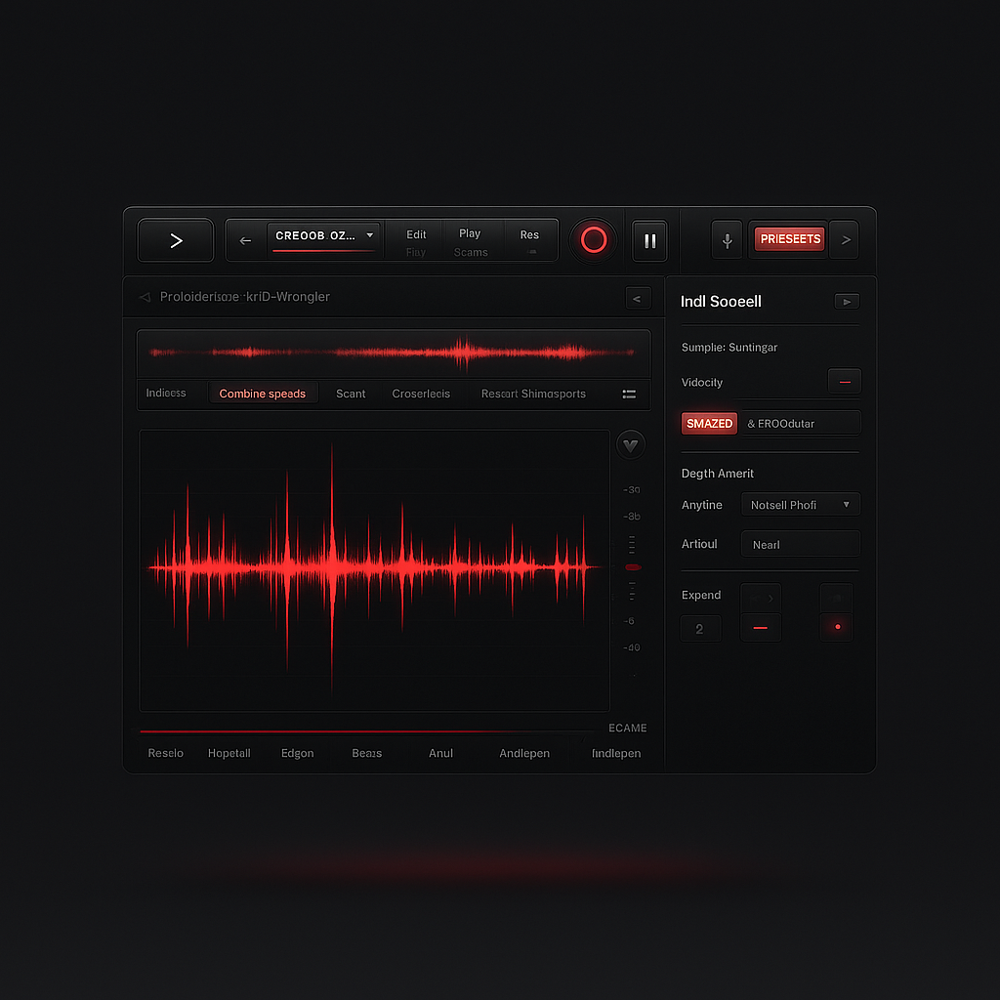

**AI-powered sample management for FL Studio**  
Scan → Analyze → Tag → Export. Stay in your flow.  

---

## 🎨 UI Mockup



---

## 🚀 Features (MVP)

- **Scan**: build a database from your sample library  
- **Analyze**: extract audio features (BPM, key, loudness, brightness, MFCCs, chroma …)  
- **Autotype**: automatic categorization (Kick, Snare, Pad, Drone, Impact …)  
- **Export**: write smart tags into the **FL Studio Browser**  

---

## 🛠️ Setup

```bash
# Create virtual environment
python -m venv .venv
.venv\Scripts\activate   # Windows
source .venv/bin/activate # macOS/Linux

# Install dependencies
pip install -r requirements.txt
```

---

## 🏃 Quickstart

```bash
# Initialize DB
python -m src.cli init

# Scan sample folder (default in config.py)
python -m src.cli scan

# Analyze audio features
python -m src.cli analyze

# Autotype samples (rules only)
python -m src.cli autotype --no-knn

# Export tags to FL Studio
python -m src.cli export_fl "C:\Users\<username>\Documents\Image-Line"   # Windows
python -m src.cli export_fl "~/Documents/Image-Line"               # macOS/Linux
```

---

## 📚 Documentation

- [Project Structure](./STRUCTURE.md)  
- [Docs folder](./docs/README.md) (setup, roadmap, details)  

---

## ⚖️ License

MIT License – free to use, hack and share.  
Dependencies: see [THIRD_PARTY_LICENSES.md](./THIRD_PARTY_LICENSES.md).  

---

🎧 **Your sound. Your flow.**<Inhalt der README.md Datei hier einfügen>
